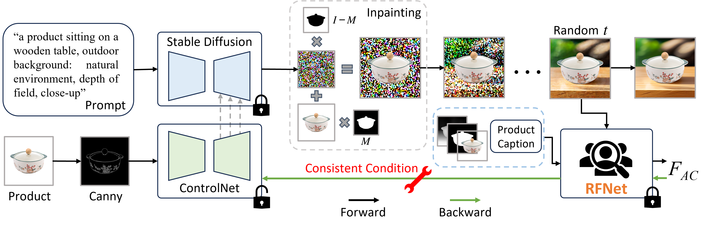

# Towards Reliable Advertising Image Generation Using Human Feedback [ECCV2024]
The official code and dataset for the paper [**Towards Reliable Advertising Image Generation Using Human Feedback**](https://arxiv.org/abs/2408.00418) (ECCV2024)
- Authors: Zhenbang Du, Wei Feng, Haohan Wang, Yaoyu Li, Jingsen Wang, Jian Li, Zheng Zhang, Jingjing Lv, Xin Zhu, Junsheng Jin, Junjie Shen, Zhangang Lin, and Jingping Shao

  

## Abstract
In the e-commerce realm, compelling advertising images are pivotal for attracting customer attention. While generative models automate image generation, they often produce substandard images that may mislead customers and require significant labor costs to inspect. This paper delves into increasing the rate of available generated images. We first introduce a multi-modal Reliable Feedback Network (RFNet) to automatically inspect the generated images. Combining the RFNet into a recurrent process, Recurrent Generation, results in a higher number of available advertising images. To further enhance production efficiency, we fine-tune diffusion models with an innovative Consistent Condition regularization utilizing the feedback from RFNet (RFFT). This results in a remarkable increase in the available rate of generated images, reducing the number of attempts in Recurrent Generation, and providing a highly efficient production process without sacrificing visual appeal. We also construct a Reliable Feedback 1 Million (RF1M) dataset which comprises over one million generated advertising images annotated by humans, which helps to train RFNet to accurately assess the availability of generated images and faithfully reflect the human feedback. Generally speaking, our approach offers a reliable solution for advertising image generation.

## Getting started

- Python >= 3.9 (Recommend to use [Anaconda](https://www.anaconda.com/download/#linux) or [Miniconda](https://docs.conda.io/en/latest/miniconda.html))
- [PyTorch >= 1.13.0+cu11.7](https://pytorch.org/)
```bash
conda create -n reliable python==3.9.0
conda activate reliable
conda install pytorch==2.0.1 torchvision==0.15.2 torchaudio==2.0.2 pytorch-cuda=11.7 -c pytorch -c nvidia

git clone https://github.com/ZhenbangDu/Reliable_AD.git
cd Reliable_AD
pip install -r requirements.txt
```

## How to inference
```bash
cd Reliable_AD

python sample.py \
--base_model_path "digiplay/majicMIX_realistic_v7" \
--controlnet_model_path  "lllyasviel/control_v11p_sd15_canny" \
--batch_size 10 \
--sampler_name 'DDIM'  \
--num_inference_steps 40 \
--config ./config/config.json  \
--data_path  ./examples \
--save_path ./outputs
```
or
```bash
cd Reliable_AD

bash sample.sh
```
We provide the weight of our finetuned ControlNet, which can be downloaded from [here](https://huggingface.co/ZhenbangDu/reliable_controlnet), or you can directly specify the ControlNet to be used for inferencing as "ZhenbangDu/reliable_controlnet".

And you can add your own configuration file in the following format:

```json
[
{
    "prompt": "a product...",
    "negative_prompt": "...",
    "image_scale": 0.66,
    "matting": false,
    "flag": 0
},
  ...
]
```
## RF1M Dataset
This dataset contains over 1 million images, divided into 30 compressed packages. The `label.txt` file in the TrainSet link contains the labels for each image. The meaning of the labels is as follows:

1. **Available**: Images deemed suitable for advertising purposes.
2. **Unsuitable**: Failed advertising images caused by original product images issues, such as product truncation or damage.
3. **Space Mismatch**: Images where the product and background have inappropriate spatial relations, such as a part of the product is floating.
4. **Size Mismatch**: Discrepancies between the product size and its background, e.g., a massage chair appears smaller than a cabinet.
5. **Indistinctiveness**: Images where the product fails to stand out due to background complexity or color similarities.
6. **Shape Hallucination**: Backgrounds that erroneously extend the product shape, adding elements like pedestals or legs.
For more details about the dataset, please refer to the paper.

[TrainSet](https://3.cn/-10gOQ79s)

[TrainSet-Subset1](https://3.cn/10hI-gq6q) (In this subset, we include part of the corresponding .png product images with an alpha channel. The filenames of the product images align one-to-one with the generated images.)

We additionally provide 1,000 product images for testing purposes. You can unzip the downloaded `testset.zip` file and use the extracted directory as the `--data_path` parameter when inferencing.

[TestSet](https://3.cn/10gO8kw-K)

## Citation
```
@inproceedings{du2024reliablead,
    title={Towards Reliable Advertising Image Generation Using Human Feedback},
    author={Zhenbang, Du and Wei, Feng and Haohan, Wang and Yaoyu, Li and Jingsen, Wang and Jian, Li and Zheng, Zhang and Jingjing, Lv and Xin, Zhu and Junsheng, Jin and Junjie, Shen and Zhangang, Lin and Jingping, Shao},
    booktitle={European Conference on Computer Vision},
    year={2024},
}
```

## Copyright
The dataset and code in this project are provided by JD.com and are intended solely for academic research purposes. Any commercial use requires explicit authorization from JD.com. Unauthorized commercial use of any part of this project is strictly prohibited.


